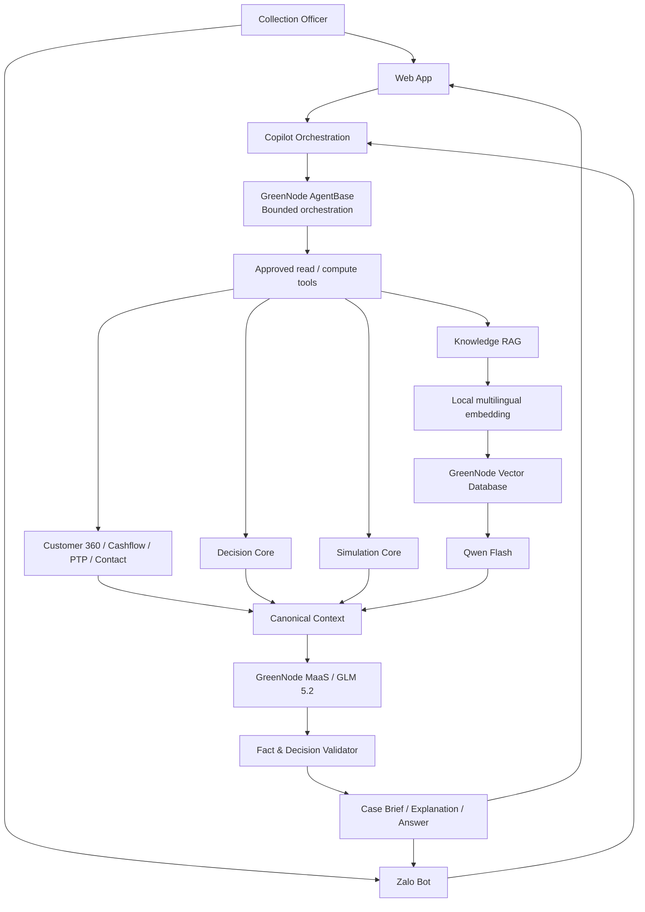

# MSB Trợ Lý Thu Hồi Nợ

> **Không tìm khách hàng nợ nhiều nhất. Tìm cơ hội thu hồi tốt nhất tiếp theo.**

**MSB Trợ Lý Thu Hồi Nợ** là sản phẩm demo cho **MSB AI Hackathon 2026 – AI for My Team**, do nhóm **Debt Radar** phát triển.

Sản phẩm hỗ trợ cán bộ Collection trả lời nhanh 4 câu hỏi quan trọng:

1. **Hôm nay nên ưu tiên hồ sơ nào?**
2. **Nên làm gì tiếp theo?**
3. **Vì sao hệ thống đề xuất như vậy?**
4. **Nếu dữ liệu thay đổi thì quyết định có thay đổi không?**

🌐 Demo: https://msb-collection-copilot.duckdns.org/

> **Lưu ý:** Bản demo sử dụng dữ liệu mô phỏng, không sử dụng dữ liệu khách hàng thật.

---

## Mục lục

- [1. Bài toán](#1-bài-toán)
- [2. Giải pháp](#2-giải-pháp)
- [3. Điểm khác biệt](#3-điểm-khác-biệt)
- [4. Recovery Opportunity Score](#4-recovery-opportunity-score)
- [5. Decision Core](#5-decision-core)
- [6. AI Case Brief](#6-ai-case-brief)
- [7. Web + Zalo](#7-web--zalo)
- [8. GreenNode AI](#8-greennode-ai)
- [9. Kiến trúc hệ thống](#9-kiến-trúc-hệ-thống)
- [10. Dữ liệu demo](#10-dữ-liệu-demo)
- [11. Tình huống mẫu SYN002846](#11-tình-huống-mẫu-syn002846)
- [12. Cấu trúc mã nguồn](#12-cấu-trúc-mã-nguồn)
- [13. Cài đặt và chạy](#13-cài-đặt-và-chạy)
- [14. Kiểm thử](#14-kiểm-thử)
- [15. Triển khai](#15-triển-khai)
- [16. An toàn và kiểm soát AI](#16-an-toàn-và-kiểm-soát-ai)
- [17. Lộ trình](#17-lộ-trình)
- [18. Lịch sử phát triển](#18-lịch-sử-phát-triển)
- [19. Nhóm phát triển](#19-nhóm-phát-triển)

---

# 1. Bài toán

Trong tác nghiệp thu hồi nợ, cán bộ không thiếu dữ liệu. Vấn đề là **biến nhiều tín hiệu rời rạc thành hành động phù hợp cho hôm nay**.

Các cách ưu tiên truyền thống như:

- tổng dư nợ;
- số ngày quá hạn;
- bucket;
- tuyến CALL/CBS;

chưa đủ để trả lời:

> **Hồ sơ nào nên được ưu tiên ngay lúc này, hành động nào phù hợp và tại sao?**

Một khách hàng có DPD cao chưa chắc phải gọi ngay nếu các tín hiệu khác cho thấy khả năng tự thanh toán vẫn tốt. Ngược lại, một hồ sơ có dư nợ thấp hơn có thể cần được xử lý sớm hơn nếu cam kết thanh toán bị vi phạm hoặc khả năng liên hệ thay đổi.

Sản phẩm tập trung vào bài toán:

> **Đúng khách hàng · Đúng hành động · Đúng thời điểm · Lý do rõ ràng**

---

# 2. Giải pháp

MSB Trợ Lý Thu Hồi Nợ kết hợp **Decision Core – Bộ máy quyết định nghiệp vụ** với **GreenNode AI**.

Các năng lực chính:

### Danh sách ưu tiên

Xếp hồ sơ theo **Recovery Opportunity – Điểm cơ hội thu hồi**, thay vì chỉ dựa vào dư nợ hoặc DPD.

### Giải thích quyết định

Cho cán bộ biết:

- vì sao hồ sơ được ưu tiên;
- vì sao nên gọi, nhắc, chờ hoặc theo dõi cam kết;
- tín hiệu nào đang ảnh hưởng tới quyết định.

### What-if Simulation – Mô phỏng tình huống

Cho phép đặt câu hỏi như:

> “Nếu tiền vào 7 ngày bằng 0 thì sao?”

Decision Core tính lại kết quả trên dữ liệu giả định nhưng **không thay đổi dữ liệu gốc**.

### Knowledge RAG – Tra cứu kiến thức có nguồn

Trả lời các câu hỏi nghiệp vụ như:

- CALL và CBS khác nhau thế nào?
- PTP là gì?
- Routing khác Treatment thế nào?

### AI Case Brief – Tóm tắt AI cho hồ sơ

Tự động tổng hợp một hồ sơ thành phần thông tin ngắn gọn:

- tình trạng hiện tại;
- quyết định hiện tại;
- bằng chứng quan trọng;
- lý do;
- điểm cán bộ cần chú ý;
- dữ liệu hoặc kiến thức còn thiếu.

---

# 3. Điểm khác biệt

## Routing không đồng nghĩa với hành động hôm nay

Một hồ sơ thuộc tuyến `CALL` không có nghĩa cán bộ **bắt buộc phải gọi ngay hôm nay**.

Hệ thống tách rõ:

- **Routing:** hồ sơ thuộc tuyến xử lý nào.
- **Treatment:** hành động cụ thể phù hợp hiện tại.
- **Channel:** kênh sử dụng cho hành động đó.
- **When:** thời điểm nên thực hiện.

## AI không thay Decision Core

LLM không được tự quyết định:

- route;
- Recovery Opportunity score;
- treatment;
- channel;
- chính sách nghiệp vụ.

AI được sử dụng để:

- hiểu câu hỏi;
- chọn đúng công cụ;
- tra cứu;
- tổng hợp;
- giải thích;
- duy trì hội thoại.

---

# 4. Recovery Opportunity Score

Recovery Opportunity là **điểm ưu tiên tương đối từ 0–100**, không phải xác suất khách hàng sẽ thanh toán.

Điểm được tính theo 6 nhóm:

| Thành phần | Điểm tối đa |
|---|---:|
| Mức khẩn cấp nghiệp vụ | 20 |
| Khả năng thanh toán | 25 |
| Mức sẵn sàng thanh toán | 20 |
| Khả năng tiếp cận | 15 |
| Thời điểm thuận lợi | 15 |
| Điều chỉnh chiến lược | 5 |
| **Tổng** | **100** |

Decision Core tính điểm theo các tín hiệu canonical của hệ thống.

README chỉ mô tả **cấu trúc trọng số**. Logic ánh xạ chi tiết từng tín hiệu nằm trong Decision Core và rule set của dự án.

### Ví dụ: SYN002846

| Thành phần | Điểm |
|---|---:|
| Mức khẩn cấp nghiệp vụ | 8 / 20 |
| Khả năng thanh toán | 20 / 25 |
| Mức sẵn sàng thanh toán | 4 / 20 |
| Khả năng tiếp cận | 11 / 15 |
| Thời điểm thuận lợi | 4 / 15 |
| Điều chỉnh chiến lược | 0 / 5 |
| **Tổng** | **47 / 100** |

> `47/100` không có nghĩa khách hàng có 47% khả năng thanh toán.

---

# 5. Decision Core

Decision Core là nguồn quyết định nghiệp vụ chính thức của hệ thống.

Thứ tự ưu tiên logic:

```text
1. Hard Policy
2. Routing
3. Hard Suppression
4. PTP / Next Action
5. Recovery Opportunity Score
6. Treatment
7. Channel
8. When
9. Explanation
```

Các nhóm treatment hiện tại gồm:

- WAIT
- WAIT_SELF_CURE
- REMIND
- CONTACT
- PTP_FOLLOW_UP
- PTP_RECOVERY
- PARTIAL_PAYMENT
- CALLBACK
- ESCALATE
- VERIFY_CONTACT

Các channel chính:

- CALL
- SMS
- ZALO
- EMAIL
- NONE

> Decision Core là deterministic business authority. AI chỉ khai thác và giải thích kết quả này.

---

# 6. AI Case Brief

AI Case Brief là lớp trợ lý giúp cán bộ hiểu một CIF trong khoảng vài chục giây.

Một Case Brief điển hình gồm:

```text
TÌNH TRẠNG HIỆN TẠI
↓
VÌ SAO HỆ THỐNG ĐƯA RA KẾT QUẢ NÀY?
↓
BẰNG CHỨNG QUAN TRỌNG
↓
CÁN BỘ NÊN CHÚ Ý GÌ?
↓
NGUỒN / DỮ LIỆU CÒN THIẾU
```

AI Case Brief áp dụng cho **mọi CIF hợp lệ**, không hard-code theo golden scenario.

### Kiến trúc kiểm soát

```text
Active CIF
   ↓
GreenNode AgentBase
   ↓
Approved read/compute tools
   ↓
Canonical Case Context
   ↓
GLM 5.2
   ↓
Structured response
   ↓
Fact / Decision Validator
   ↓
UI
```

AgentBase chỉ chọn **công cụ cần thiết**.

Decision Core vẫn giữ quyền quyết định.

### Fallback

AI Case Brief có cơ chế suy giảm an toàn:

```text
AgentBase + GLM
        ↓ nếu lỗi
Static canonical orchestration + GLM
        ↓ nếu lỗi
Deterministic basic brief
```

Customer page không phụ thuộc hoàn toàn vào AI để hoạt động.

---

# 7. Web + Zalo

Sản phẩm cung cấp hai kênh sử dụng:

## Web

Phù hợp khi cần xem sâu:

- danh sách ưu tiên;
- hồ sơ khách hàng;
- AI Case Brief;
- score breakdown;
- evidence;
- simulation;
- knowledge assistant.

## Zalo

Phù hợp cho câu hỏi nhanh:

```text
Hôm nay tôi phải làm gì?

Vì sao cần xem SYN001346?

Điểm của SYN000746 được tính như thế nào?

CALL và CBS khác nhau thế nào?

Nếu tiền vào 7 ngày bằng 0 thì sao?

Thế giờ làm gì?
```

> **Hai kênh khác nhau, cùng một Bộ máy quyết định.**

---

# 8. GreenNode AI

GreenNode được sử dụng như **AI intelligence layer**, không phải business decision engine.

## AgentBase

AgentBase giúp trợ lý:

- hiểu mục đích câu hỏi;
- chọn đúng công cụ;
- lấy đúng dữ liệu cần thiết;
- điều phối luồng hỏi đáp trong phạm vi được cho phép.

AgentBase không có quyền thay đổi route, score hoặc treatment.

## GreenNode MaaS + GLM 5.2

GLM 5.2 hỗ trợ:

- hiểu ngôn ngữ tự nhiên;
- tổng hợp canonical context;
- diễn giải quyết định;
- tạo câu trả lời ngắn gọn cho cán bộ.

## GreenNode Vector Database + Qwen Flash

Dùng cho knowledge RAG:

```text
Câu hỏi
↓
Local multilingual embedding
↓
GreenNode Vector Database
↓
Qwen Flash
↓
Câu trả lời có nguồn
```

> Local multilingual embedding chạy cục bộ và nằm ngoài GreenNode-hosted boundary.

---

# 9. Kiến trúc hệ thống



### Nguyên tắc authority

```text
Decision Core
    > Canonical business facts
    > Simulation Core
    > Grounded knowledge
    > AgentBase planning
    > GLM wording
```

---

# 10. Dữ liệu demo

Bộ dữ liệu synthetic được xây dựng để mô phỏng workflow Collection:

- **3.000 CIF**
- **5.287 khoản vay**
- khoảng **60.000 dòng cashflow**
- khoảng **12.000 payment records**
- khoảng **6.500 call records**
- khoảng **2.500 operation/PTP records**
- **20 Golden Scenarios**
- **5 HERO scenarios**
- seed: `20260828`

Các nguồn nghiệp vụ được mô phỏng gồm:

- customer portfolio;
- loan/overdraft/card;
- cashflow;
- payment;
- PTP;
- call history;
- customer segment;
- route/treatment/channel.

Không sử dụng dữ liệu khách hàng thật.

---

# 11. Tình huống mẫu SYN002846

`SYN002846` là golden scenario dùng để minh họa sự khác nhau giữa **route** và **action**.

### Baseline

```text
DPD                         11 ngày
Tiền vào 7 ngày             48 triệu đồng
Dòng tiền ròng 30 ngày      168 triệu đồng
PTP                         Chưa có
Route                       CALL
Recovery Opportunity        47 / 100
Treatment                   Chờ khách hàng tự thanh toán
Channel                     Chưa cần liên hệ
```

Mặc dù thuộc tuyến CALL, hệ thống không yêu cầu cán bộ gọi ngay.

### What-if

Giả định:

```text
Tiền vào 7 ngày = 0
Dòng tiền ròng 30 ngày = 0
```

Decision Core tính lại:

```text
Trước:
Chờ khách hàng tự thanh toán
Chưa cần liên hệ

Sau:
Liên hệ khách hàng
Gọi điện
```

> Mô phỏng không làm thay đổi dữ liệu gốc.

---

# 12. Cấu trúc mã nguồn

Các thư mục cụ thể có thể thay đổi theo từng phiên bản, nhưng dự án được tổ chức theo các responsibility chính:

```text
frontend/
  Web UI, landing, authenticated app, AI Case Brief UI

backend / application modules
  API, orchestration, session, tools

Decision Core
  routing, score, NBA, treatment, channel

AI / Agent modules
  AgentBase adapter
  Case Context Builder
  Case Brief Generator
  Validator
  Cache / audit

Knowledge / RAG
  document retrieval
  local embedding
  GreenNode Vector DB
  Qwen Flash

Zalo
  client
  worker
  conversation
  state / dedupe

tests/
  business canaries
  Zalo conversation
  Agent/tool selection
  RAG
  frontend
  integration

task-results/
  engineering / QA / production closeout evidence
```

> Khi phát triển, ưu tiên giữ responsibility tách biệt; không nhét Decision Core, Agent orchestration và transport vào cùng một module.

---

# 13. Cài đặt và chạy

## Yêu cầu

Khuyến nghị:

- Linux / Ubuntu
- Git
- Python 3
- Node.js + npm
- quyền truy cập GreenNode AI nếu muốn chạy AI path
- Zalo Bot credentials nếu muốn chạy Zalo integration

> Phiên bản runtime chính xác nên tuân theo lock/config files đang có trong repository.

## Clone

```bash
git clone https://github.com/quyethd/msb-collection-copilot.git
cd msb-collection-copilot
```

## Cấu hình môi trường

Tạo file `.env` theo cấu hình runtime của dự án.

**Không commit `.env` hoặc secret lên Git.**

Các nhóm cấu hình có thể bao gồm:

```text
GreenNode MaaS credentials
GreenNode Vector Database
Zalo Bot API
internal tool authentication
runtime/service configuration
```

Xem tài liệu runtime trong repository để biết tên biến môi trường đang được sử dụng.

## Frontend

```bash
cd frontend

npm ci
npm test
npm run build
```

Build output được sinh trong thư mục build của frontend theo cấu hình hiện tại.

## Backend

Backend phải được chạy theo runtime/service configuration của repository.

Trong production hiện tại, backend được bind nội bộ thay vì expose trực tiếp ra Internet.

Hãy đọc runtime documentation/service definitions trong repository trước khi chạy backend hoặc Zalo worker.

---

# 14. Kiểm thử

Dự án ưu tiên test theo gate thay vì chỉ kiểm tra “chạy được”.

Các nhóm test chính:

### Business correctness

- Decision parity
- Score parity
- Golden scenarios
- Simulation
- Business semantic drift

### AI / Agent

- tool-selection accuracy
- wrong-tool rate
- unnecessary-tool rate
- wrong CIF
- cross-CIF context leak
- simulation context leak
- unsupported decision claims

### Zalo conversation

- paraphrase
- follow-up
- topic continuity
- slang/typo
- duplicate response
- no-response
- live roundtrip

### Frontend

- component tests
- build
- desktop/mobile visual QA
- navigation/session regression

Các canary quan trọng:

```text
SYN002846:
route=CALL
score=47

SYN000746:
score=69
```

---

# 15. Triển khai

Production demo hiện tại:

```text
https://msb-collection-copilot.duckdns.org/
```

Mô hình triển khai hiện tại:

```text
Internet
↓
OpenLiteSpeed / HTTPS
↓
Static frontend
↓
Internal backend
↓
Decision Core / AI / RAG / Zalo services
```

Các nguyên tắc deploy:

- backup trước khi deploy;
- frontend và backend deploy độc lập khi có thể;
- không restart service không liên quan;
- không expose backend internal port;
- giữ TLS verification;
- rollback nếu business canary hoặc auth boundary bị phá.

---

# 16. An toàn và kiểm soát AI

Sản phẩm áp dụng nguyên tắc:

> **Hiểu linh hoạt hơn, nhưng quyết định không tự do hơn.**

Các guardrail chính:

- Decision Core là authority.
- AgentBase dùng tool allowlist.
- Không expose write/action tools cho Agent.
- LLM không tự tính score.
- LLM không thay route/treatment/channel.
- Simulation được tách khỏi baseline.
- Context được cô lập theo CIF/chat.
- AI output phải qua validator.
- Có fallback khi AgentBase hoặc model lỗi.
- Không commit secret.
- Demo dùng synthetic data.

---

# 17. Lộ trình

## Hiện tại

- Web App
- Zalo Bot
- Decision Core
- Recovery Opportunity Score
- What-if Simulation
- Knowledge RAG
- GreenNode Vector Database
- GreenNode MaaS / GLM 5.2
- bounded AgentBase orchestration
- AI Case Brief
- synthetic data / golden scenarios

## Bước tiếp theo

### Shadow Mode Pilot

Chạy Copilot song song với quy trình hiện tại:

```text
Vận hành hiện tại
+
Copilot recommendation
↓
So sánh với actual outcome
↓
Đánh giá trước khi rollout
```

### Tích hợp dữ liệu thực

Hướng tới:

- T24
- DigiLenO
- Contact Center
- Collection operational systems

### Đo outcome

Các chỉ số cần đo:

- cure rate;
- PTP kept rate;
- collected amount;
- contact efficiency;
- calls per collected VND;
- officer handling time;
- AI Case Brief usefulness;
- override reason.

---

# 18. Lịch sử phát triển

## Giai đoạn 1 — Business foundation

- khóa bài toán Collection Officer;
- CALL/CBS routing;
- DPD / outstanding;
- PTP;
- call history;
- cashflow;
- Next Best Action;
- Recovery Opportunity.

## Giai đoạn 2 — Explainable Decision Core

- deterministic scoring;
- decision precedence;
- evidence;
- What-if Simulation;
- Golden Scenarios.

## Giai đoạn 3 — GreenNode AI + RAG

- GreenNode MaaS / GLM 5.2;
- knowledge RAG;
- Vector Database;
- Qwen Flash;
- local multilingual embedding;
- source-grounded answers.

## Giai đoạn 4 — Web + Zalo

- Web Copilot;
- Zalo Bot;
- active-CIF context;
- simulation follow-up;
- duplicate protection;
- shared Decision Core.

## Giai đoạn 5 — AI Case Brief + AgentBase

- bounded AgentBase orchestration;
- dynamic tool selection;
- canonical case context;
- AI Case Brief;
- strict fact/decision validator;
- multi-level fallback;
- production multi-CIF validation.

## Giai đoạn 6 — Landing / Pitch experience

- interactive pitch-deck landing;
- AI Case Brief narrative;
- AgentBase / GreenNode truth;
- Debt Radar identity;
- responsive desktop/mobile QA.

## Giai đoạn 7 — Conversation quality

Đang tiếp tục tối ưu:

- paraphrase understanding;
- follow-up resolution;
- topic continuity;
- priority explanation;
- score disambiguation;
- real conversation replay;
- live Zalo quality.

---

# 19. Nhóm phát triển

**Debt Radar**

Sản phẩm được phát triển trong khuôn khổ **MSB AI Hackathon 2026 – AI for My Team**.

Powered by **GreenNode AI**.

---

## Ghi chú

Đây là bản demo/experimental product phục vụ Hackathon và kiểm chứng kiến trúc.

Không nên hiểu các số liệu tác động trong demo là ROI đã được chứng minh trong vận hành thực tế.

Các bước cần thực hiện trước khi áp dụng thật tại MSB gồm:

- real-data pilot;
- Shadow Mode;
- IAM/RBAC;
- audit trail;
- model/knowledge governance;
- monitoring/SLA;
- outcome evaluation;
- data classification và masking;
- security review.

---

## Repository hygiene

Trước khi public repository hoặc nhận contribution, nên bổ sung:

- `LICENSE`
- `SECURITY.md`
- `CONTRIBUTING.md`
- `CHANGELOG.md`
- `docs/ARCHITECTURE.md`
- `docs/DECISION_CORE.md`
- `docs/AI_GOVERNANCE.md`

Không đưa vào repository:

- `.env`
- API keys
- Zalo access token
- GreenNode credentials
- production secrets
- dữ liệu khách hàng thật
